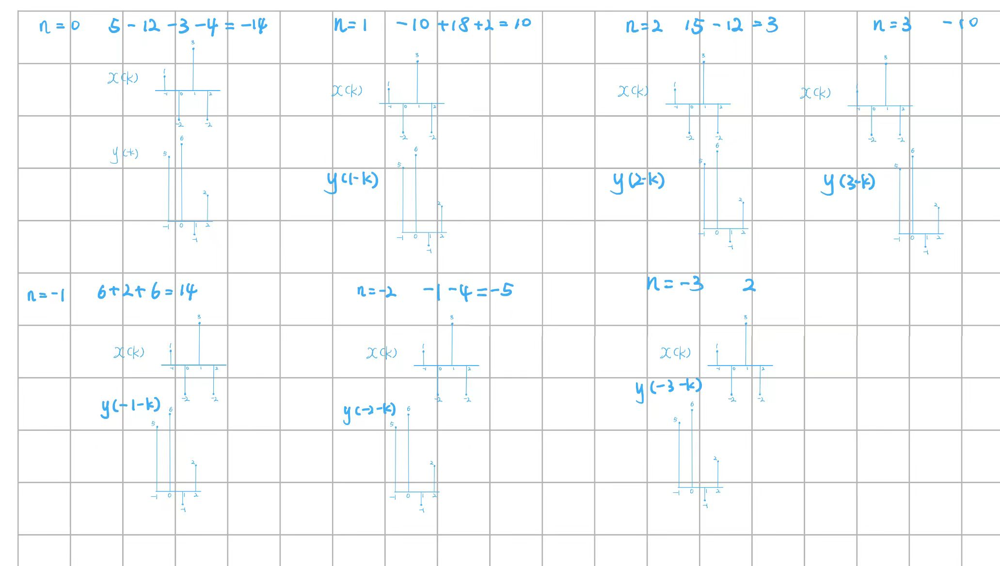

# homework 1

## Question 1

(a) 线性：$T[x_1(n)]=n x_1(n), T[x_2(n)]=n x_2(n)$
$x_3(n)=ax_1(n)+bx_2(n),a和b为常数$
$T(x_3(n))=nx_3(n)=nax_1(n)+nbx_2(n)=aT[x_1(n)]+bT[x_2(n)]$
移变：$y(n)=T[x(n)]=nx(n)$
$x(n-n_0) \to y(n)=T[x(n-n_0)]=(n)x(n-n_0)$
因果：$y(n_0)=T[x(n_0)]=n_0x(n_0)$, 只与$x(n_0)$有关
不稳定：$|x(n)|<M, \forall n \to |y(n)|=|nx(n)|<|n|M$,对于任意大M,当n充分大时，|y(n)|无界

(b) $T[x(n)]=e^{x(n)}$
非线性：$T[x_1(n)]=e^{x_1(n)}, T[x_2(n)]=e^{x_2(n)}$
$x_3(n)=ax_1(n)+bx_2(n),a和b为常数$
$T(x_3(n))=e^{ax_1(n)+bx_2(n)} \neq aT[x_1(n)]+bT[x_2(n)]$
移不变：$y(n)=T[x(n)]=e^{x(n)}$
$x(n-n_0) \to T[x(n-n_0)]=e^{x(n-n_0)}=y(n-n_0)$
因果：$y(n_0)=T[x(n_0)]=e^{x(n_0)}$, 只与$x(n_0)$有关
稳定：$|x(n)|<M, \forall n \to |y(n)|=|e^{x(n)}| \leq e^M$,有界输入有界输出

(c) $T[x(n)]=x(n+2)+ax(n)$
线性：$T[x_1(n)]=x_1(n+2)+ax_1(n), T[x_2(n)]=x_2(n+2)+ax_2(n)$
$x_3(n)=ax_1(n)+bx_2(n),a和b为常数$
$T(x_3(n))=x_3(n+2)+ax_3(n)=a[x_1(n+2)+ax_1(n)]+b[x_2(n+2)+ax_2(n)]=aT[x_1(n)]+bT[x_2(n)]$
移不变：$y(n)=T[x(n)]=x(n+2)+ax(n)$
$x(n-n_0) \to T[x(n-n_0)]=x(n-n_0+2)+ax(n-n_0)$
$=y(n-n_0)$
非因果：$y(n_0)=T[x(n_0)]=x(n_0+2)+ax(n_0)$, 与$x(n_0+2)$有关
稳定：$|x(n)|<M, \forall n \to |y(n)|=|x(n+2)+ax(n)| \leq |x(n+2)|+|a||x(n)| < (1+|a|)M$,有界输入有界输出

## Question 2

(a) 是。$T=\frac{14}{3}k, k \in Z^+$
(b) 不是。$\pi$的系数是无理数。
(c) 不是。$cos(12n)$无周期。

## Question 3

对位相乘法：

                    1   -2    3    -2
                    2   -1    6    5
    —————————————————————————————————
                    5   -10   15   -10
                 6  -12  18   -12
            -1   2  -3   2
        2   -4   6  -4
    —————————————————————————————————
        2   -5  14  -14   10   3    -10

卷积和$y(n)=\{2,3,10,\underline{10},30,3,-10\}$

图解法：

## Question 4

卷积交换律：

$x(n)\ast y(n)=\sum_{k=-\infty}^{\infty}x(k)y(n-k)=\sum_{m=-\infty}^{\infty}x(n-m)y(m)=y(n)\ast x(n)$

卷积结合律：

$[x(n)\ast y(n)]\ast z(n)=\sum_{l=-\infty}^{\infty}\sum_{k=-\infty}^{\infty}x(k)y(l-k)z(n-l)=\sum_{m=-\infty}^{\infty}\sum_{k=-\infty}^{\infty}x(k)y(m)z(n-m-k)$

$x(n)\ast [y(n)\ast z(n)]=\sum_{l=-\infty}^{\infty}\sum_{k=-\infty}^{\infty}y(k)z(l-k)x(n-l)=\sum_{m=-\infty}^{\infty}\sum_{k=-\infty}^{\infty}y(k)x(m)z(n-m-k)$

故$[x(n)\ast y(n)]\ast z(n)=x(n)\ast [y(n)\ast z(n)]$

卷积分配律：
$[x(n)+y(n)]\ast z(n)=\sum_{k=-\infty}^{\infty}[x(k)+y(k)]z(n-k)=\sum_{k=-\infty}^{\infty}x(k)z(n-k)+\sum_{k=-\infty}^{\infty}y(k)z(n-k)=x(n)\ast z(n)+y(n)\ast z(n)$

## Question 5

已知线性移不变系统的输入为$x(n)$，系统的单位抽样响应为$h(n)$, 求系统输出$y(n)$;

(a) $x(n)=\delta(n-2),h(n)=0.5^n R_3(n)$

$y(n)=\sum_{k=0}^{2}0.5^k\delta(n-k-2)=0.5^0\delta(n-2)+0.5^1\delta(n-1)+0.5^2\delta(n)=0.25\delta(n)+0.5\delta(n-1)+\delta(n-2)$

(b) $x(n)=2^n u(-n-1),h(n)=0.5^n u(n)$

当$n \leq -1$时，$y(n)=\sum_{k=-\infty}^{n}2^k0.5^{n-k}=\sum_{k=-\infty}^{n}4^k0.5^n=0.5^n \frac{4^{n+1}}{4-1}=\frac{4}{3}\cdot 2^n$

当$n \geq -1$时，$y(n)=\sum_{k=-\infty}^{-1}2^k0.5^{n-k}=\sum_{k=-\infty}^{-1}4^k0.5^n=0.5^n \frac{1}{1-4}=\frac{1}{3}\cdot 0.5^n$

## Question 6

1